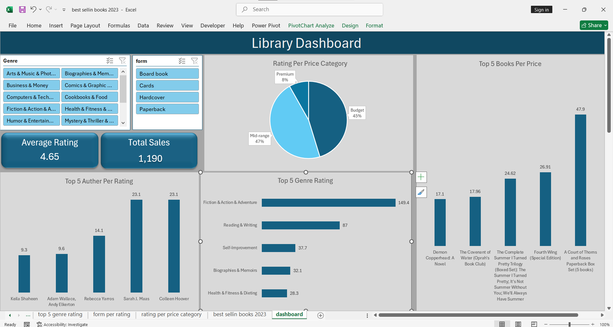

# **Library & Best-Sellers Dashboard**

### **Objective**
Designed a comprehensive dashboard to analyze book sales performance and reader preferences, identifying the key factors that drive a book's success in the market.

### **Technical Implementation**
* **Advanced Filtering:** Implemented interactive Slicers for **Genre** and **Book Form** (Paperback, Hardcover, etc.) to allow for deep-dive analysis.
* **Pricing Segmentation:** Categorized books into **Budget (45%)**, **Mid-range (47%)**, and **Premium (8%)** tiers to study market distribution.
* **KPI Tracking:** Monitored essential metrics including **Average Rating (4.65)** and **Total Sales (1,190 units)**.

### **Key Insights**
* **Genre Leadership:** **Fiction, Action & Adventure** is the clear leader in popularity, significantly outperforming other genres by rating volume.
* **Price Sensitivity:** Over **90%** of the market is dominated by Budget and Mid-range books, suggesting that affordability is a major driver for high ratings.
* **Author Performance:** Identified top-rated authors like **Sarah J. Maas** and **Colleen Hoover** as major contributors to the library's high performance.
* **Value Correlation:** The analysis of "Top 5 Books Per Price" shows that premium-priced sets, like "A Court of Thorns and Roses," still maintain high demand due to perceived value.

---
### **Dashboard Preview**

